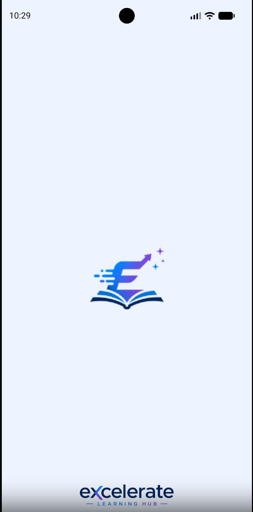
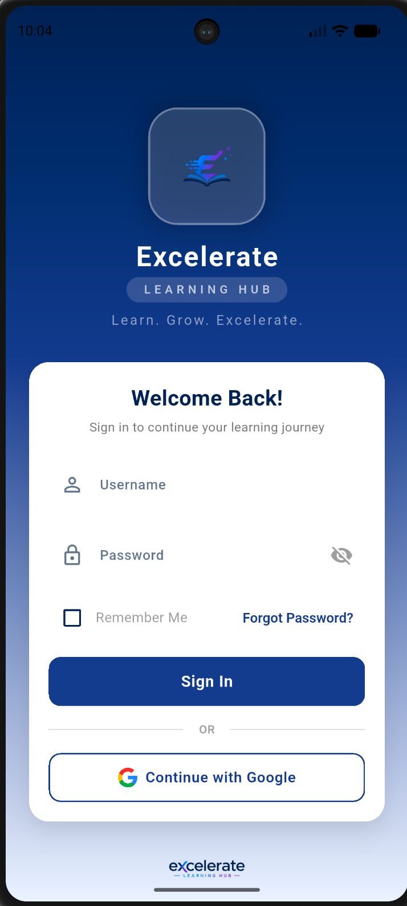
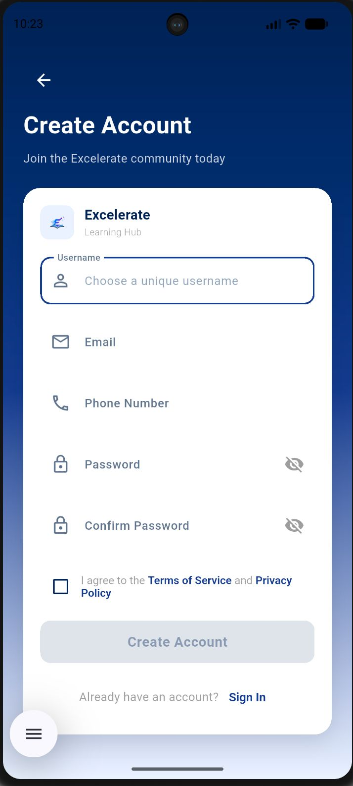
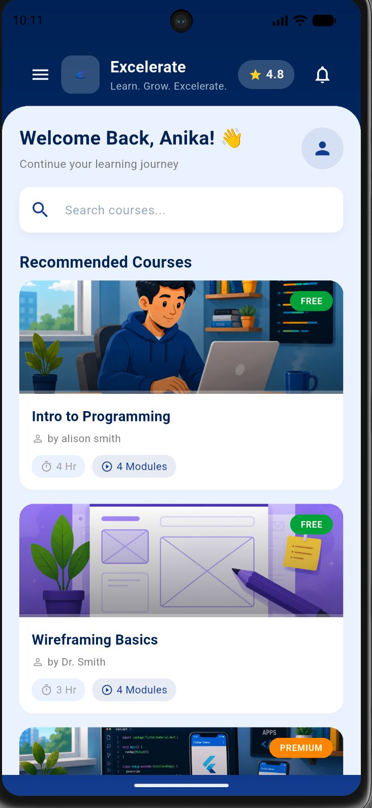
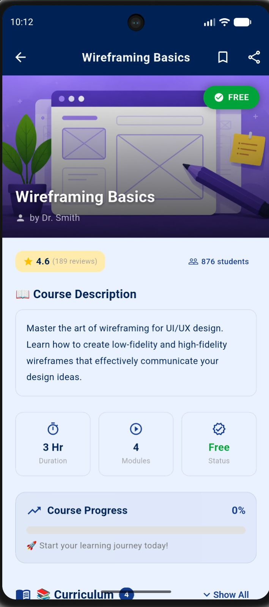

# ExcelerateLearningHub

## Project Vision

excelerateLearningHub is a mobile e-learning application designed to provide learners with a simple, organized, and user-friendly platform for accessing educational courses. The application aims to make online learning more accessible by allowing users to browse courses and easily access course content.

## Getting Started

1. Ensure Flutter SDK is installed (check with `flutter --version`)
2. Clone the repo and run `flutter pub get`
3. Run `flutter run` to launch on a connected device/emulator

## Project Objectives

The main objectives of the project are:

- Provide a secure user registration and login system.
- Display courses on the home screen.
- Allow users to view detailed course information and learning modules.
- Provide an easy-to-use interface for learners.

## Current Limitations / Data Layer

This build uses mock/in-memory data — accounts and progress are not persisted between app restarts.

## Target Users

### Learners
- Register a new account.
- Log in securely.
- Access course content.

## Core Features

- User Registration
- User Login
- Home Dashboard with course search
- Course Details

## Application Screens

1. Splash Screen
2. Login Screen
3. Registration Screen
4. Home Screen
5. Course Details Screen

## Navigation Flow

```
Launch App
      │
      ▼
    Splash
      │
      ▼
Login / Register
      │
      ▼
  Home Screen
      │
      ▼
 Course Details
      │
      ▼
    (back)
```

## User Journey

### Learner

1. Open the application.
2. Register or log in.
3. View the personalized home screen.
4. Select a course.
5. View the course contents.
6. Start learning.

## Expected Outcome

The application provides a simple and organized learning experience where learners can easily discover educational courses and access their contents.

## Future Enhancements

- Video lessons
- Progress tracking
- Certificates
- Course enrollment
- Dark mode
- Notifications
- Firebase (Authentication & Database)

## Technology Stack

- Figma (Wireframes & UI Design)
- Flutter (Frontend)

## Screenshots

| Splash Screen | Login Screen | Register Screen |
| :---: | :---: | :---: |
|  |  |  |

| Home Screen | Course Details |
| :---: | :---: |
|  |  |

## Project Name

**excelerateLearningHub**
